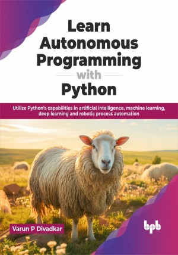

# Learn Autonomous Programming with Python

Unleash the hidden potential of Python to emerge as a change maker of contemporary industry

This is the repository for [Learn Autonomous Programming with Python
](https://bpbonline.com/products/learn-autonomous-programming-with-python?variant=43177752985800),published by BPB Publications.

## About the Book
The current industry (also called Industry 4.0) has witnessed an unprecedented expansion of technology in a short span of time, owing to an exponential increase in computational power coupled with internet technology. Consequently, domains like artificial intelligence, machine learning, deep learning and robotic process automation have gained prominence and become the backbone of organizations, making it inevitable for professionals to upgrade their skills in these domains. 

Orchestrate your work with AI and ML. Learn RPA's power, conduct web symphonies, utilize spreadsheets, and automate emails. You can also extract data from PDFs and images, choreograph applications, and play with deep learning. Design workflows, create hyperautomation finales, and combine Python with UiPath. You can further build a solid stage for your projects with PyScript, and continue with test automation. 

This book equips you to revolutionize your work, one Python script at a time. This book can be used as ready to reference as well as a user manual for quick solutions to common organizational needs and even for brushing up on key technical domain concepts.

## What You Will Learn
• You will have a clear understanding of Python and create concise, flexible and maintainable applications for current industry needs.

• You will explore web scraping techniques using powerful libraries to extract valuable data from the web.

• You will have a high level overview of fundamentals in ML, deep learning, RPA, and hyperautomation.

• You will learn to write compact and maintainable code in Python catering to typical applications in contemporary industries. 

• You will also learn how to apply your learnings to real world industry scenarios using the practical Python use cases presented at the end of each chapter.
